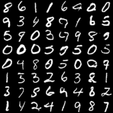
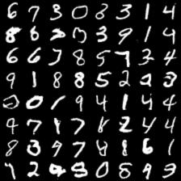

#DCGAN

original python impl: https://github.com/Newmu/dcgan_code

sample output@20th epoch:

sample output@40th epoch:

sample output@60th epoch:

sample output@80th epoch:

sample output@100th epoch:

training time: ~166s/epoch on GTX960
